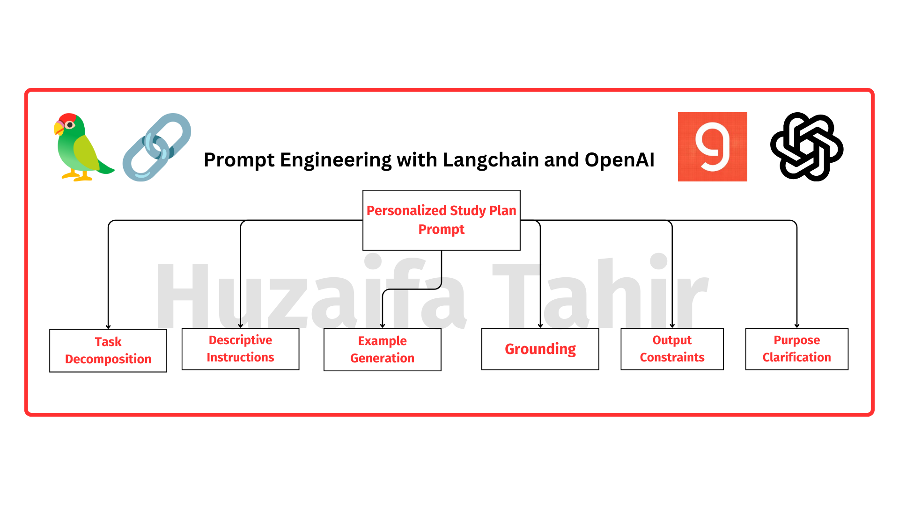
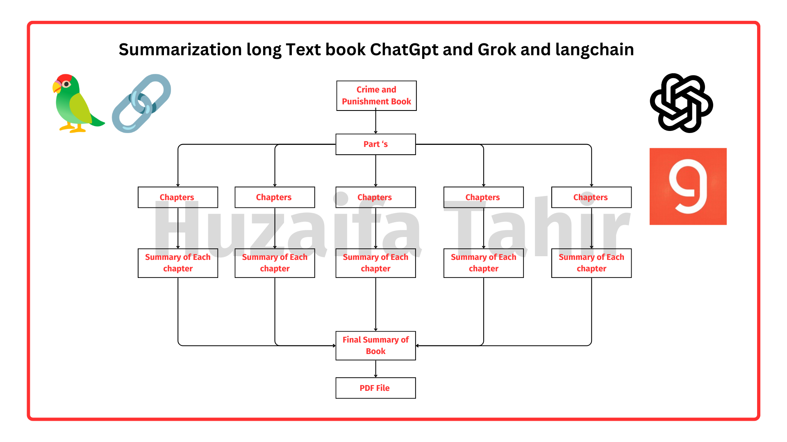

# AI-Powered Study Plan and Book Summarization

This repository contains two powerful AI-driven solutions: a prompt engineering template for generating personalized study plans and a hierarchical summarization system for condensing lengthy books into comprehensive summaries. Both solutions leverage advanced language models and prompt engineering techniques to deliver tailored and efficient outputs.

## Table of Contents

- [AI-Powered Study Plan and Book Summarization](#ai-powered-study-plan-and-book-summarization)
  - [Table of Contents](#table-of-contents)
  - [Overview](#overview)
  - [Personalized Study Plan Prompt](#personalized-study-plan-prompt)
    - [Installation](#installation)
    - [Usage](#usage)
    - [Prompt Details](#prompt-details)
    - [Prompt Engineering Techniques](#prompt-engineering-techniques)
  - [Summarization System](#summarization-system)
    - [Key Features](#key-features)
    - [Usage](#usage-1)
    - [Implementation Details](#implementation-details)
    - [Challenges and Solutions](#challenges-and-solutions)
    - [Next Steps](#next-steps)
  - [Contributing](#contributing)
  - [License](#license)

## Overview

This project combines two powerful AI solutions: a personalized study plan prompt and a book summarization system. The personalized study plan prompt generates tailored study plans for students based on their unique needs, strengths, and aspirations. The summarization system, on the other hand, condenses lengthy books into comprehensive summaries, addressing the token limit constraint of GPT-4.

## Personalized Study Plan Prompt

<p align="center">
  
</p>

### Installation

To use this prompt, you'll need to have the following dependencies installed:

- Python 3.10
- LangChain
- OpenAI GPT-4,Groq
- PDF converter  FPDF

You can install the required packages using pip:

```bash
pip install -r requirements.txt
```
### Usage

1. Clone this repository to your local machine.
2. Import the necessary modules and load the prompt template.
3. Provide the required student data as input variables.
4. Generate the personalized study plan using the prompt template and your preferred language model.

For more detailed usage instructions, please refer to the [Prompt Details](#prompt-details) section.

### Prompt Details

The prompt details, including input variables, key components, and prompt engineering techniques, are explained in the [prompt.ipynb](./prompt.ipynb) file.

### Prompt Engineering Techniques

The personalized study plan prompt incorporates the following prompt engineering techniques:

- Task Decomposition
- Descriptive Instructions
- Example Generation
- Grounding
- Output Constraints
- Purpose Clarification

For more information on these techniques and how they are implemented in the prompt, please refer to the [prompt.ipynb](./prompt.ipynb) file.


## Summarization System

<p align="center">
  
</p>

### Key Features

- **Hierarchical Summarization:** Utilizes a multi-level summarization approach to handle lengthy texts within the token limit.
- **ChatGPT and Groq Integration:** Employs ChatGPT for initial chapter summaries and Groq for final comprehensive summaries.
- **Text Segmentation:** Divides the book into smaller units for efficient processing and summary generation.
- **File Handling:** Saves individual chapter summaries and combines them to form a final summary for easy access.

### Usage

1. **Input:** Provide the lengthy book in a compatible format (e.g., PDF, plain text).
2. **Execution:** Run the provided Python script to initiate the summarization process.
3. **Output:** Access the final comprehensive summary generated by the system.

### Implementation Details

- **Chapter Summarization:** Utilizes ChatGPT to summarize each chapter individually.
- **Comprehensive Summary:** Employs Groq to generate a cohesive summary by combining the chapter summaries.
- **File Management:** Organizes summaries into separate files for easy retrieval and reference.

### Challenges and Solutions

- **Token Limit Constraint:** Mitigated by breaking down the book into smaller units and progressively summarizing them.
- **Coherence and Consistency:** Ensured through careful integration of chapter summaries into the final comprehensive summary.
- **API Rate Limits:** Handled by implementing rate limiting mechanisms and optimizing API usage.

### Next Steps

- Explore further optimization techniques to enhance the efficiency and quality of summarization.
- Incorporate user feedback mechanisms to refine and improve the summarization process.
- Extend support for additional document formats and integration with external storage services.

## Contributing

Contributions to this project are welcome. If you have any suggestions, bug reports, or feature requests, please open an issue or submit a pull request.

## License

This project is licensed under the [MIT License](./LICENSE).